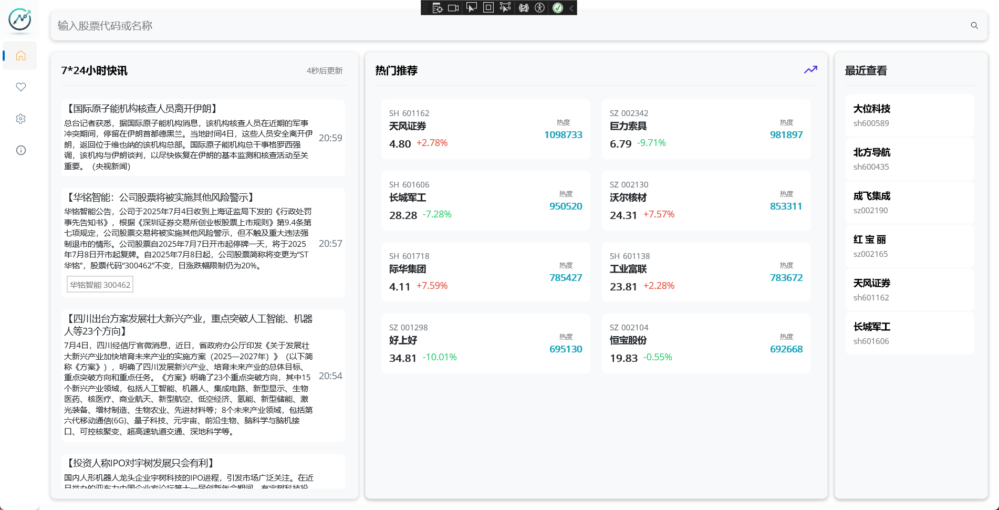
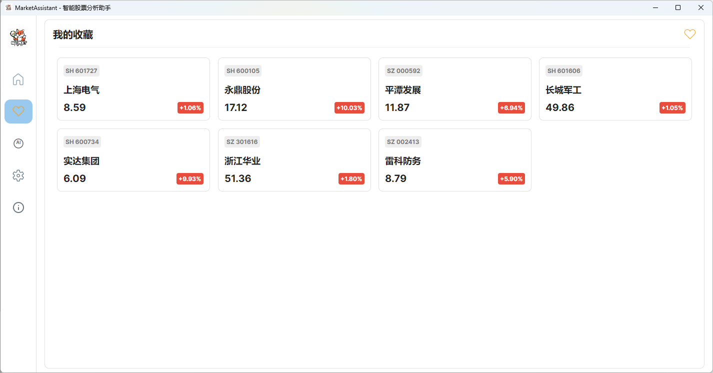
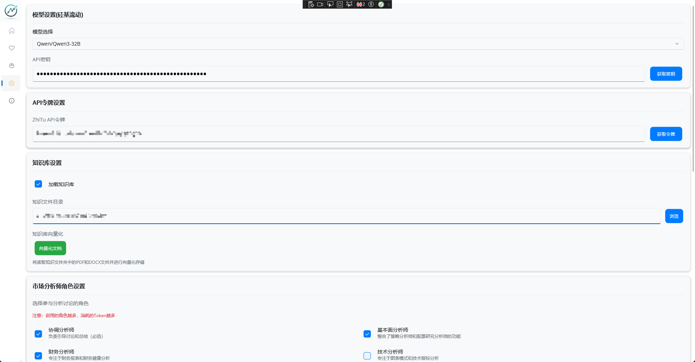
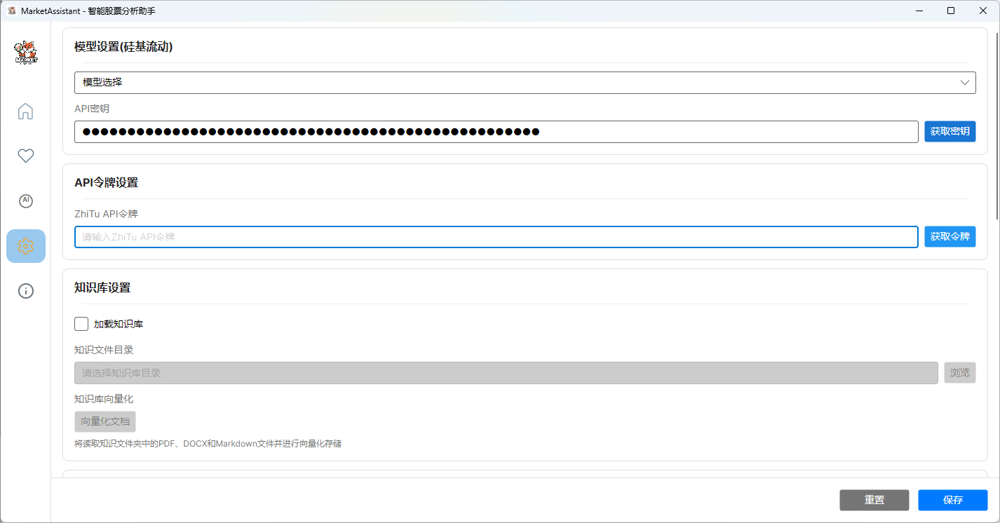
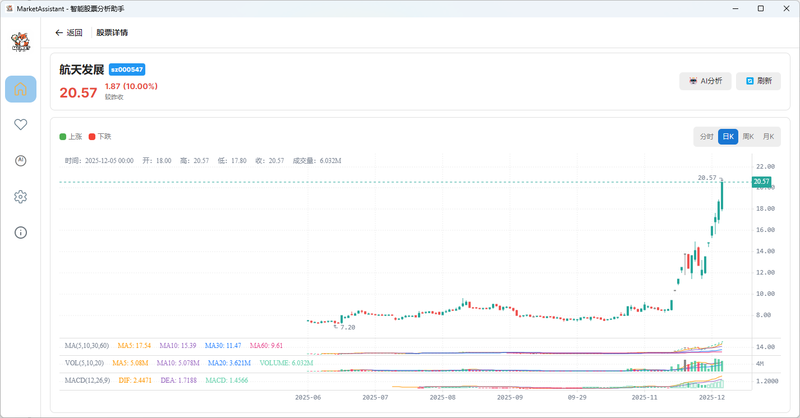
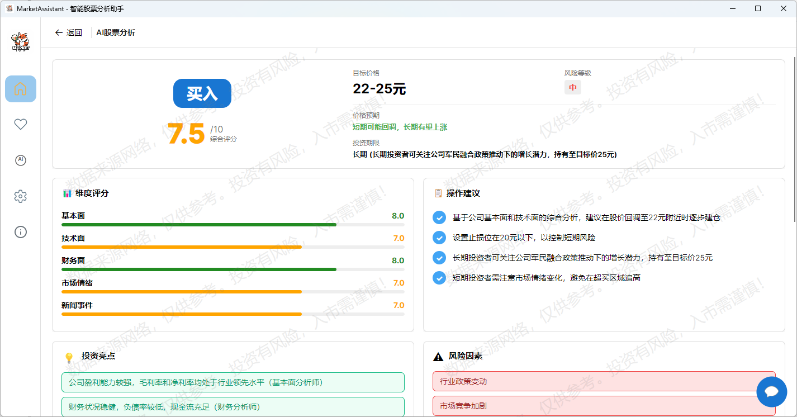

## ✨ 简介

本项目基于 Avalonia UI 开发，结合 AI 大模型构建的跨平台金融市场分析工具。目前已支持 **A 股** 和 **虚拟币（Crypto）** 两个市场，通过多 AI 分析师并行协作，自动化生成多维度投资分析报告。

基于实时数据，利用 AI 分析大量金融数据，提供动态实时洞察。快速汇集相关信息，全面审核整个情况，旨在为投资者、交易员和研究者提供专业的分析参考。

本项目仅供学习研究，投资有风险，入市需谨慎。

## 🧱 架构概览

- `MarketAssistant.App`：Avalonia UI 宿主，只负责视图、ViewModel、导航、通知、样式和内容文件输出。
- `MarketAssistant.App.Services`：应用运行时与业务编排层，承载 Agent 实现、Workflow、Tool 实现、RAG、MCP、交易引擎和业务服务。
- `MarketAssistant.Agents`：Agent 契约层，定义分析师基类、工具抽象、分析模型和提示词配置加载。
- `MarketAssistant.DataProviders`：外部行情与资讯数据接入层。
- `MarketAssistant.Trading`：交易抽象与共享交易模型。
- `MarketAssistant.Core`：基础模型、异常、转换器和市场枚举等通用能力。

当前依赖关系为：`Core <- Trading/DataProviders <- Agents/App.Services <- App`，其中 `Agents` 额外依赖 `Trading` 中的共享交易抽象，`App` 作为 UI 宿主还直接引用部分共享模型与服务。

## 📊 主要功能

### 多市场支持

- **A 股市场**：股票搜索、基本面/技术面/财务/情绪/新闻五维分析
- **虚拟币市场**：支持 Binance 实时行情、K 线、资金费率、多空比等数据

### AI 多分析师协作分析

通过 Fan-Out/Fan-In 工作流，5 位专业 AI 分析师并行分析后由协调分析师综合判断：

- **基本面分析师**：公司/项目基本情况、行业地位、长期价值
- **技术分析师**：K 线图形态、MACD/KDJ/BOLL 等技术指标、交易策略
- **财务分析师**：财务报表、偿债能力、盈利质量、现金流
- **市场情绪分析师**：市场情绪、资金流向、投资者行为
- **新闻事件分析师**：新闻事件、公告解读、突发事件影响
- **协调分析师**：整合上述分析、解决分歧、生成最终投资建议

### AI 选股功能

- **用户需求分析**：根据投资偏好智能推荐
- **新闻驱动选股**：基于市场新闻事件进行选股
- **快速策略选股**：预设多种选股策略（价值股、成长股、大盘股、小盘股、红利股）

### 自主交易（虚拟币）

- 策略配置：止损/止盈/追踪止损/AI 信号策略
- 实时监控：Binance WebSocket 实时价格监控
- 风控管理：多维度风控（仓位限制、单日亏损限制等）
- 当前交易执行链以 `IExchangeClient` 统一抽象接入 Binance 现货能力，合约支持仍在规划中

### 文档向量化（RAG）

- **向量化搜索**：支持 PDF、DOCX 文档向量化
- **知识库集成**：结合本地文档进行深度分析
- **查询改写与重排序**：优化检索质量

### MCP 工具扩展

- 支持 Model Context Protocol (MCP) 服务器集成
- 支持 stdio/SSE/StreamableHttp 三种传输方式
- 可扩展外部工具和数据源

### 数据可视化

- K 线图展示（WebView）
- 技术指标可视化
- 分析报告结构化展示（评分、评级、关键指标）

## ⚙️ 高级配置

### MCP服务器配置
MarketAssistant支持Model Context Protocol (MCP)服务器配置，可以集成外部工具和数据源：

1. 在设置页面点击"MCP服务器配置"
2. 添加新的MCP服务器
3. 配置服务器类型（stdio/sse/streamableHttp）
4. 设置命令/URL和环境变量

### 向量数据库配置
应用使用SQLite向量数据库存储文档嵌入：
- 自动管理向量存储
- 支持大规模文档检索

## 📸 功能截图

### 主界面

### 股票收藏

### AI选股

### 软件设置

### 股票详情

### 分析报告

## 🔍 性能优化建议

### 1. 模型选择策略
- **日常分析**: 使用免费的`Qwen/Qwen3-32B`模型
- **深度研究**: 使用`deepseek-ai/DeepSeek-R1`或`Qwen3-235B-A22B`

### 2. 成本控制
- 合理设置分析师角色，避免不必要的API调用
- 持续优化提示词

## 🌟 应用优势

### 智能化程度高
- 多个AI分析师协作，提供全方位分析视角
- 自动整合多维度数据，生成专业投资报告

### 使用便捷性
- 一键开始分析，无需复杂配置
- 支持多种选股策略，满足不同投资风格
- 直观的可视化界面，易于理解分析结果

### 专业性强
- 涵盖基本面、技术面、情绪面等多重分析
- 支持自定义文档库，增强分析深度
- 提供具体的操作建议和风险提示

## 🔒 安全性说明

### API密钥安全
- API密钥使用本地加密存储
- 不会上传到任何第三方服务器
- 建议定期更换API密钥

### 数据隐私
- 所有股票分析数据仅在本地处理
- 向量化文档存储在本地SQLite数据库
- 仅分析请求会发送到大模型服务商
  
## 🖥️ 平台支持

- Windows
- macOS
- Linux

## 🛠️ 技术栈

- **UI 框架**：Avalonia UI 11.3
- **运行时**：.NET 10.0
- **AI 框架**：MAF (Microsoft Agent Framework)
- **向量存储**：Semantic Kernel SQLiteVec
- **日志**：Serilog
- **MVVM**：CommunityToolkit.Mvvm
- **技术指标**：Skender.Stock.Indicators
  
## 🙏 鸣谢

本项目大部分代码由 AI 智能编程助手生成。在此特别感谢Copilot、Cursor 强大的代码生成能力，为本项目的开发提供了极大帮助。

## 📄 许可证

Apache License 2.0