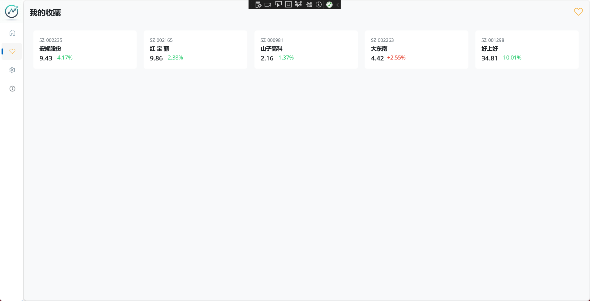
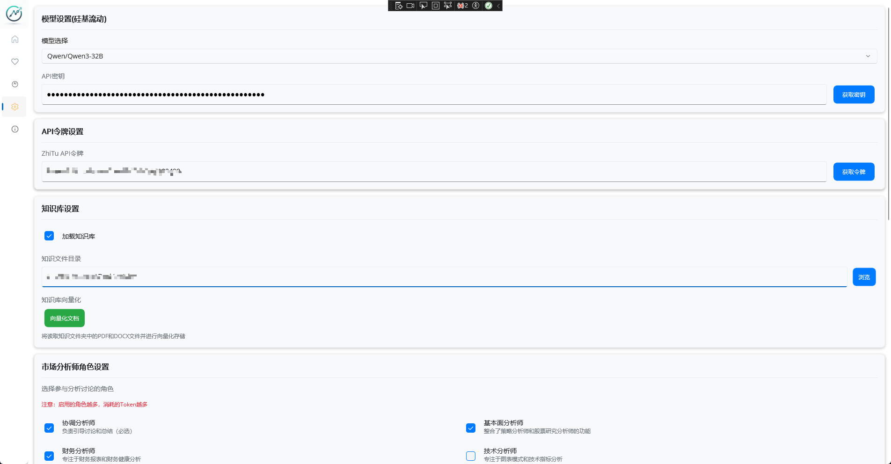
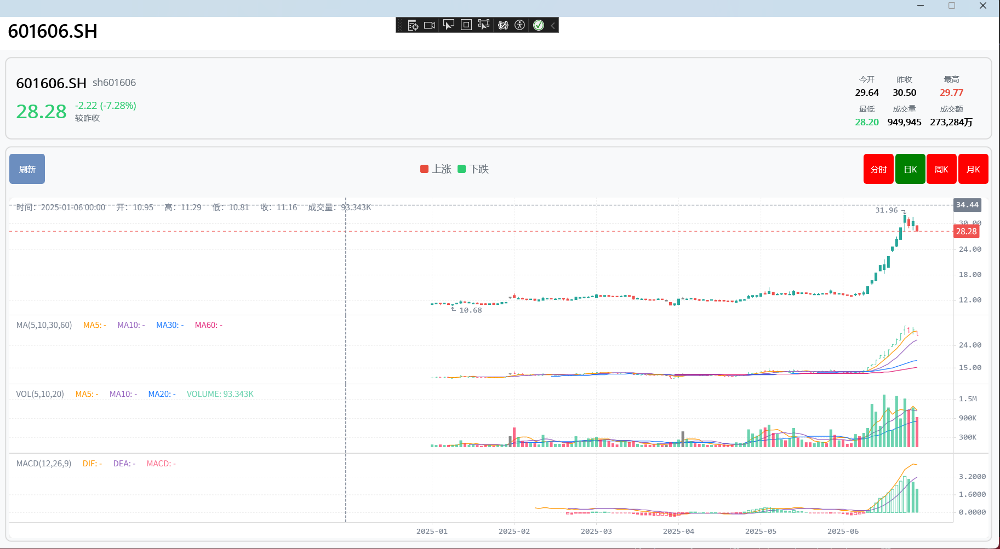
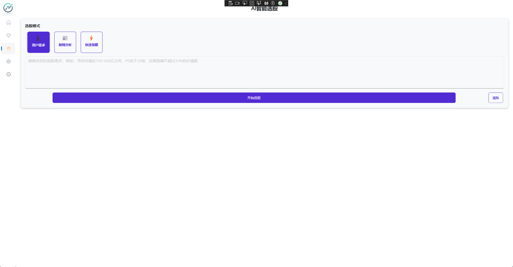

## ✨ 简介

本项目基于 Avalonia UI 开发，结合 AI 大模型构建的跨平台股票分析工具。目前已支持 A 股，未来计划加入港股、美股、虚拟币等支持。

基于实时数据，旨在做出明智的决策，主要专注于金融市场。它利用分析大量数据，提供股票等的动态实时洞察。快速汇集相关信息，全面审核整个情况，旨在为投资者、交易员和顾问提供最佳结果

。本项目仅供学习研究，投资有风险，入市需谨慎。

## 📊 主要功能

### 股票分析

- **基本面分析**：公司基本情况、财务状况、行业地位等
- **技术面分析**：K线图、技术指标、趋势分析
- **新闻事件分析**：相关新闻、公告解读
- **市场情绪分析**：市场整体情绪、个股情绪
- **财务分析**：季度财报、现金流、盈利能力
  
### AI选股功能
- **用户需求分析**: 根据投资偏好智能推荐股票
- **新闻驱动选股**: 基于市场新闻事件进行选股
- **快速策略选股**: 预设多种选股策略
  - 价值股策略：PE<20, PB<3, ROE>10%
  - 成长股策略：营收增长>20%, 利润增长>15%
  - 大盘股策略：市值>500亿的蓝筹股
  - 小盘股策略：50-200亿市值的成长股
  - 红利股策略：股息率>3%的稳定分红股

### 文档向量化

- **向量化搜索**: 支持PDF、DOCX文档向量化
- **知识库集成**: 结合本地文档进行深度分析
- **上下文感知**: AI模型结合文档内容提供精准建议

### 数据可视化

- 股票K线图展示
- 技术指标可视化
- 分析结果直观展示

## ⚙️ 高级配置

### MCP服务器配置
MarketAssistant支持Model Context Protocol (MCP)服务器配置，可以集成外部工具和数据源：

1. 在设置页面点击"MCP服务器配置"
2. 添加新的MCP服务器
3. 配置服务器类型（stdio/sse/streamableHttp）
4. 设置命令/URL和环境变量

### 向量数据库配置
应用使用SQLite向量数据库存储文档嵌入：
- 自动管理向量存储
- 支持大规模文档检索

## 📸 功能截图

### 主界面

### 股票收藏

### 基本设置

### 分析报告

### 结构化报告 

### K线

### AI选股

## 🔍 性能优化建议

### 1. 模型选择策略
- **日常分析**: 使用免费的`Qwen/Qwen3-32B`模型
- **深度研究**: 使用`deepseek-ai/DeepSeek-R1`或`Qwen3-235B-A22B`

### 2. 成本控制
- 合理设置分析师角色，避免不必要的API调用
- 持续优化提示词

## � 应用优势

### 智能化程度高
- 多个AI分析师协作，提供全方位分析视角
- 自动整合多维度数据，生成专业投资报告

### 使用便捷性
- 一键开始分析，无需复杂配置
- 支持多种选股策略，满足不同投资风格
- 直观的可视化界面，易于理解分析结果

### 专业性强
- 涵盖基本面、技术面、情绪面等多重分析
- 支持自定义文档库，增强分析深度
- 提供具体的操作建议和风险提示

## 🔒 安全性说明

### API密钥安全
- API密钥使用本地加密存储
- 不会上传到任何第三方服务器
- 建议定期更换API密钥

### 数据隐私
- 所有股票分析数据仅在本地处理
- 向量化文档存储在本地SQLite数据库
- 仅分析请求会发送到大模型服务商
  
## 🖥️ 平台支持

- Windows
- macOS
- Linux

## 🛠️ 技术栈

- Avalonia UI 11.3.7
- .NET 9.0
- Semantic Kernel
- CommunityToolkit.Mvvm
  
## 🙏 鸣谢

本项目大部分代码由 AI 智能编程助手生成。在此特别感谢 Trae AI、Copilot、Cursor 强大的代码生成能力，为本项目的开发提供了极大帮助。

## 📄 许可证

Apache License 2.0