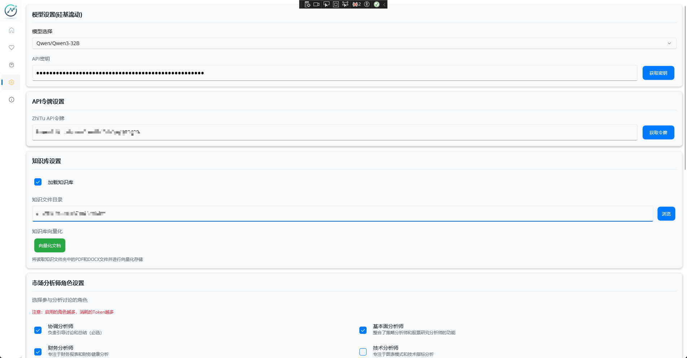

# MarketAssistant SiliconCloud 集成配置指南

## 📥 软件下载

在开始配置之前，请确保您已经安装了MarketAssistant：

**下载地址**: [MarketAssistant Releases](https://github.com/X2Agent/MarketAssistant/releases)

请选择适合您操作系统的版本进行下载和安装。

## 📋 关于本指南

本指南专门介绍如何在MarketAssistant中配置和使用SiliconCloud的AI模型服务。

> 📝 **提示**: 如果您想了解MarketAssistant的完整功能介绍，请参考项目的[官方文档](https://github.com/X2Agent/MarketAssistant)。

SiliconCloud为MarketAssistant提供了强大的大语言模型支持，本指南将帮助您：
- 快速配置SiliconCloud API
- 选择合适的AI模型
- 优化使用成本和性能
- 解决常见的集成问题

## 🚀 快速配置

### 步骤1: 获取SiliconCloud API密钥
1. 访问 [SiliconCloud官网](https://cloud.siliconflow.cn/) 
2. 完成注册后，进入 [API密钥管理页面](https://cloud.siliconflow.cn/account/ak)
3. 点击"创建新密钥"
4. 复制生成的API Key（请妥善保存）

### 步骤2: 在MarketAssistant中配置

1. 打开MarketAssistant应用
2. 导航到"设置"页面
3. 在"AI模型配置"部分填入：
   <!-- - **API端点**: `https://api.siliconflow.cn` -->
   - **API密钥**: 粘贴您的SiliconCloud API Key
   - **模型ID**: 选择合适的模型（见下方推荐）
   - **嵌入模型**: 保持默认`BAAI/bge-m3`
4. 若需获取股票数据，请前往 [智兔官网](https://www.zhituapi.com/) 注册并获取Token，然后在此处填写对应的Token
5. 点击"保存"按钮

### 步骤3: 验证配置
1. 保存配置后，尝试进行一次股票分析
2. 如果分析成功，说明配置正确
3. 如有问题，请查看应用日志

## 🤖 模型选择指南

### 推荐配置组合

| 使用场景       | 推荐模型                        | 特点                   | 适用对象   |
| -------------- | ------------------------------- | ---------------------- | ---------- |
| **日常使用**   | `Qwen/Qwen3-32B`                | 快速响应，成本较低     | 个人投资者 |
| **专业分析**   | `deepseek-ai/DeepSeek-R1`       | 推理能力强，分析深度高 | 专业投资者 |
| **长文档处理** | `Tongyi-Zhiwen/QwenLong-L1-32B` | 支持长上下文           | 研报分析   |
| **复杂策略**   | `Qwen/Qwen3-235B-A22B`          | 超强理解能力           | 量化策略   |

### 完整支持列表
- `Qwen/Qwen3-32B` - 通义千问32B版本
- `deepseek-ai/DeepSeek-R1` - DeepSeek推理模型
- `deepseek-ai/DeepSeek-V3` - DeepSeek V3版本
- `Qwen/Qwen3-235B-A22B` - 超大规模模型
- `Tongyi-Zhiwen/QwenLong-L1-32B` - 长文本模型
- `THUDM/GLM-4-32B-0414` - 智谱GLM-4模型
- `THUDM/GLM-Z1-Rumination-32B-0414` - 深度思考模型
- `tencent/Hunyuan-A13B-Instruct` - 腾讯混元模型
- `moonshotai/Kimi-K2-Instruct` - Kimi K2模型

## 🔒 安全最佳实践

### API密钥安全
- ✅ **安全做法**:
  - API密钥仅存储在本地
  - 定期更换API密钥

### 数据隐私
- 股票分析数据仅在本地处理
- 仅向SiliconCloud发送分析请求
- 向量化文档存储在本地SQLite数据库

## 📊 优化建议

1. **模型调优**: 根据实际使用效果调整模型选择
2. **批量处理**: 充分利用AI选股等批量功能
3. **配置调整**: 根据使用模式调整分析师角色

## 📞 技术支持

### 获取帮助
- **SiliconCloud官方支持**: [support@siliconflow.cn](mailto:support@siliconflow.cn)
- **MarketAssistant问题**: 查看项目GitHub页面的Issues部分
- **社区讨论**: 参与相关技术社区讨论

### 故障报告
如遇到技术问题，请提供以下信息：
1. MarketAssistant版本号
2. 使用的SiliconCloud模型
3. 具体错误信息和日志
4. 复现步骤

---

## 📝 小结

通过本指南，您应该能够：
- ✅ 成功配置SiliconCloud API
- ✅ 选择适合的AI模型
- ✅ 优化使用成本
- ✅ 解决常见问题

配置完成后，您就可以充分利用SiliconCloud的AI能力进行专业的股票分析了。如有疑问，请参考故障排除部分或寻求技术支持。
