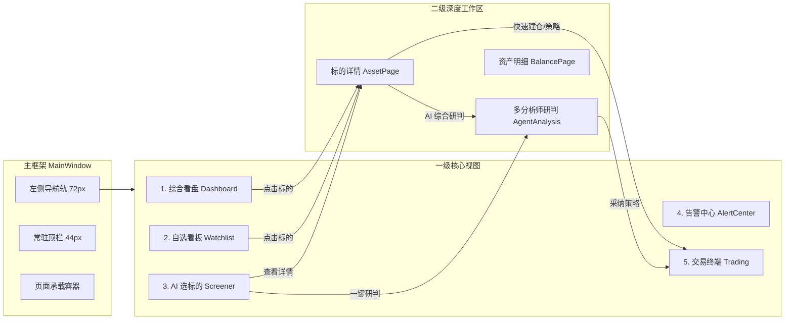

# MarketAssistant 界面设计与交互架构规范 (Design.md)

> **文档版本**: 1.1  
> **更新日期**: 2026-09-12  
> **定位**: 本文档是 MarketAssistant (跨平台金融数据与 AI 交易终端) 的完整页面设计、交互架构与重构蓝图，**当前为唯一生效的设计规范**。  
> **审视基准**: 本文档基于当前真实代码实现、金融终端业务痛点与 AI 原生交互范式建立。  
> **历史说明**: 原设计系统文档（v2.4，`docs/design-system.md`）因存在若干与代码脱节的陈旧声明与理想化偏差，已被本文档取代并**于 2026-09-12 删除**；其完整颜色 Token 对照表以 `src/MarketAssistant.App/Resources/Styles/Colors.axaml` 与 `Spacing.axaml` 为唯一事实源，可视化预览见 [`配色预览.html`](配色预览.html)，原文可通过 git 历史追溯。下文第二章审计表保留作为该取代关系的背景记录。

---

## 一、产品定位与核心设计哲学

### 1.1 产品定位
MarketAssistant 是一款面向高阶投资者与量化交易者的 **AI 原生金融市场工作站**。它横跨 **A 股市场**（严监管、T+1、交易时段限制、人民币计价）与 **虚拟币市场**（7×24小时、高波动、杠杆合约、USDT/BTC 计价），集成了多分析师协同（MAF Multi-Agent）、本地/外部知识库（RAG/MCP）、实时行情监控与自动化交易执行。

### 1.2 核心设计哲学
1. **金融终端的严谨 × 现代 SaaS 的克制**:
   - 杜绝花哨无意义动效，优先确保数据刷新时的极低渲染抖动与即时可读性。
   - 采用深色背景四层体系，减少长时间盯着盘面产生的眩光。
2. **AI 原生而非 AI 附庸 (AI-Native, Not AI-Addon)**:
   - 传统的 AI 助手往往只是一个悬浮侧边抽屉或独立聊天页，导致“看盘时无法对话，对话时看不到数据”。
   - MarketAssistant 将 AI 深度嵌入业务流：在资产页提供即时异动归因，在分析页提供分屏常驻伴侣（Docked Co-Pilot），在策略页提供 AI 参数回测与风险释义。
3. **闭环决策漏斗 (Closed-Loop Workflow)**:
   - 形成清晰的投资链路：**市场概览 (Home) → 标的初筛 (Screening) → 深度多智能体研判 (Analysis) → 策略回测与风控 (Strategy) → 执行与盯盘 (Trading/Alert)**。
4. **统一中的市场异构 (Dual-Market Cohesion)**:
   - 框架与交互结构统一，但底层字段、时间轴、风控维度按市场严格区分，不做生硬套用。

---

## 二、当前页面实现与设计系统差异审计 (Reality Check)

经过对当前代码库 `src/MarketAssistant.App` 的全面审查，`docs/design-system.md` 存在若干“文档声称已完成，但实际代码未落地或存在严重冲突”的问题：

| 检查项 | `design-system.md` 声称状态 | 实际代码真实状态 | 影响与隐患 |
|---|---|---|---|
| **White 硬编码文字色** | 声称 v2.4 已将约 22 处 `Foreground="White"` 全部收敛至 `TextOnEmphasisBrush` | `ButtonStyles.axaml` (6处) 与 `MainWindow.axaml` (1处) 仍存在 `<Setter Property="Foreground" Value="White"/>` | 浅色模式下若按钮变体继承异常会出现白底白字，破坏 Token 一致性 |
| **Emoji 清理** | 声称 v2.3 已全量替换为 SVG 线性图标 | `AssetSelectionPageViewModel.cs` 中仍硬编码 `👤`, `📰`, `⚡`, `📈`；`AdaptiveCard` 解析器仍包含 `📈`, `📰`, `💰` | 跨平台 (Windows/macOS/Linux) 下不同系统的 Emoji 渲染字形与风格严重分裂 |
| **数据字体 Token 化** | 声称统一使用 `StaticResource DataFontFamily` | `AnalystResultCardView.axaml` (第89行) 仍硬编码 `FontFamily="Consolas, 'Cascadia Mono', monospace"` 与硬编码字号 | 破坏字体层级，Mac/Linux 下若缺对应字体会导致等宽对齐失效 |
| **K 线图表控件封装** | 声称图表主题化已彻底落地 | `KLineChartView.cs` 在代码后置中通过 C# 动态拼装 UI，Loading/Error 视图为硬编码样式，未绑定应用主题画刷 | 深浅主题切换时，异常面板和加载状态闪烁且与宿主背景色突兀 |
| **顶栏行情条 (TopBar Ticker)** | 原型与文档设计了完整的大盘行情滚动条 | `MainWindowViewModel.cs` 中 `IndexTickers` 完全为空，`RebuildIndexTickers()` 仅清空集合，长期处于隐藏状态 | 顶部横向空间严重浪费，用户无法对大盘指数一瞥便知 |
| **AI 伴侣交互形态** | 当前实现为模态遮罩抽屉 (`AgentAnalysisPageView.axaml` ZIndex 2000) | 打开抽屉时将整个主报告区域全部置灰变暗 (`DarkOverlayBrush`) | 用户向 AI 提问报告细节时，报告本身被暗色遮罩遮挡，无法一边看图表一边对话 |
| **自选股展示模式** | 仅提供固定 290px 卡片的 `WrapPanel` | 缺乏高密度数据表格视图 (Table View) | 当自选标的高达数十只时，翻页与滚动手感极差，无法快速多字段对比排序 |

---

## 三、信息架构与导航拓扑重构

### 3.1 导航链路拓扑图



### 3.2 导航结构重构建议
1. **一级导航主项**：
   - `首页 (Dashboard)`: 市场总览、行情异动、快讯流、快捷搜索。
   - `自选 (Watchlist)`: 多分组管理、双视图切换（卡片视图 / 高密度网格表）。
   - `AI选标的 (Screener)`: 需求驱动选股、热点事件选股、量化指标初筛。
   - `交易 (Trading)`: 仅在当前市场能力支持时展示（Crypto 支持，A股隐藏或转为模拟盘/沙盘）。
   - `告警 (Alerts)`: 价格告警与风控联动门统一出口，带动态未读计数红点。
2. **底部固定项**：
   - `设置 (Settings)`: API 密钥、模型配置、知识库管理。
   - `关于 (About)`: 版本信息、环境状态。
3. **深度研判页 (AgentAnalysisPageView) 定位纠偏**：
   - 保持作为二级沉浸式工作区，但从 `AssetDetailPage` 与 `ScreenerPage` 均可平滑跳转，并在顶部提供明确的层级面包屑或返回按钮。

---

## 四、核心页面详细设计与实现蓝图

### 4.1 主窗口框架 (MainWindow & TopBar)

#### 4.1.1 现状与痛点
- 窗口原生标题栏与应用内部 TopBar 形成“双层顶栏”，浪费垂直空间 30-40px。
- 市场切换分段器 (`A股` / `虚拟币`) 放在顶栏右侧，但在二级页面时会被直接隐藏（`IsVisible="{Binding !CanGoBack}"`），导致在二级页面无法感知当前市场上下文。
- 顶部行情条长期空置。

#### 4.1.2 重构方案
- **高度整合的紧凑顶栏 (Unified TopBar 44px)**:
  - 左侧：页面标题与返回层级（`← 返回上一页 | 标的详情 - 600519 贵州茅台`）。
  - 中间：大盘指数滚动条（A股：上证指数、深证成指、创业板指；Crypto：BTC、ETH、SOL、全网总市值）。未接入真实数据前展示骨架或折叠，不留大片空白。
  - 右侧：常驻市场切换胶囊（A股 / Crypto），即便在二级页面也明确标识当前市场；旁边放置系统告警铃铛与连接健康状态点。
- **左侧导航轨 (Nav Rail 72px)**:
  - 维持克制图标化设计，增加当前选中项左侧 3px 竖条（`PrimaryBrush`）与浅色底面高亮（`SelectedBackgroundBrush`）。
  - 底部告警项与顶部导航项统一支持红点/徽标显示。

---

### 4.2 首页大盘 (HomePageView)

#### 4.2.1 现状与痛点
- 搜索框放置在顶部独立 Card 中，输入资产跳转单一。
- Bento Grid 采用硬编码 3:2 列宽比，宽屏下左列大量留白，窄屏下右侧快讯挤压。
- 缺乏市场情绪冷热、涨跌家数分布（大盘广度 Breadth）等宏观指标。

#### 4.2.2 重构设计蓝图
```
┌────────────────────────────────────────────────────────────────────────┐
│ 🔍 全局命令搜索条 (支持拼音首字母/代码/自然语言: "找市盈率<20的新能源股")   │
├────────────────────────────────────────────────────────────────────────┤
│ 宏观晴雨表: [上涨 3,240 | 平 420 | 下跌 1,510]  成交额 1.2万亿  北向 +45.2亿 │
├───────────────────────────────────┬────────────────────────────────────┤
│ 热门标的榜单 (Hot Assets - 60%)   │ 7×24 实时快讯 (Telegraph - 40%)    │
│  [涨幅榜] [成交榜] [AI热议榜]     │  [全部] [重大利好] [风险预警]      │
│  - 标的行: 代码/名称/现价/涨跌幅  │  - 时间戳 + 情绪胶囊 + 正文摘要   │
│  - 迷你趋势折线 (Sparkline)       │  - 关联股票快捷 Tag (点击即直达)   │
├───────────────────────────────────┴────────────────────────────────────┤
│ 最近浏览历史 (横向紧凑药丸列表，支持鼠标滚轮平滑滚动)                   │
└────────────────────────────────────────────────────────────────────────┘
```

#### 4.2.3 关键技术与实现细节
- **搜索防抖与 IME 保护**: 保持当前的自绘 `Popup` + `ListBox` 模式，增加键盘 `Up/Down` 选词与 `Enter` 直达，避免原生 `AutoCompleteBox` 的拼音输入法冲突。
- **快讯卡片增强**: 引入基于正负面词法的背景色弱强调（利好浅绿背景/边框，利空浅红背景/边框），并展示关联标的代码药丸。

---

### 4.3 标的详情与行情分析 (AssetPageView)

#### 4.3.1 现状与痛点
- 页面仅有基本价格 + 大卡片 K 线图，信息密度显著低于专业金融终端。
- 缺少五档买卖盘（盘口）、分时成交明细（Tick 流）、技术指标数值面板。
- 用户在当前页无法直接进行快捷交易配置或加入自选操作。

#### 4.3.2 重构设计蓝图
```
┌────────────────────────────────────────────────────────────────────────┐
│ 标的信息栏: 名称 [代码]  现价 1,820.00  +32.50 (+1.82%)  最高/最低/成交量 │
│ 操作区: [⭐ 加入自选] [🤖 AI深度研判] [⚡ 快捷下单/网格策略] [🔄 刷新]     │
├────────────────────────────────────────┬───────────────────────────────┤
│ K 线图表工作区 (主栏 75%)               │ 深度盘口与指标面板 (右侧 25%)   │
│ - 周期切换: 分时 / 1m / 15m / 1h / 日K │ - 买五卖五 / 订单簿深度堆叠     │
│ - 指标开关: MA / EMA / MACD / BOLL / KDJ│ - 逐笔交易最新流 (Time & Sales)│
│ - WebView (klinecharts) 交互           │ - 核心基本面/技术面速览指标    │
├────────────────────────────────────────┴───────────────────────────────┤
│ 底部选项卡: [新闻公告] [AI 异动速评] [财务摘要]                          │
└────────────────────────────────────────────────────────────────────────┘
```

#### 4.3.3 K 线图表宿主技术重构
- 彻底移除 `KLineChartView.cs` 代码后置中的硬编码字体和字号。
- 将 Loading/Error 面板声明在 XAML 或使用统一的 `SkeletonStyles` / `ErrorPanel` 样式，确保与设计系统画刷（`DynamicResource CardBackgroundBrush` 等）绝对同步。

---

### 4.4 AI 选标的 (AssetSelectionPageView)

#### 4.4.1 现状与痛点
- 界面上的三个模式卡片使用 Emoji 图标（`👤`, `📰`, `⚡`）。
- 生成结果列表后，缺少多选操作、批量自选或结果横向对比功能。
- 分析执行时使用全屏阻塞蒙层，无法进行其他页面浏览。

#### 4.4.2 重构设计蓝图
- **替换 Emoji 为矢量 SVG 图标**：
  - 用户需求模式：`/Assets/Images/icon_users.svg`
  - 新闻热点模式：`/Assets/Images/icon_document.svg`
  - 快速量化模式：`/Assets/Images/icon_bolt.svg`
- **结果呈现区升级**：
  - 卡片顶部显示综合匹配度得分（Score Badge）。
  - 提供 `加入自选` 与 `发起深度研判` 双快捷按钮。
  - 增加按得分降序、按涨跌幅排序的过滤栏。

---

### 4.5 多智能体协同分析 (AgentAnalysisPageView)

#### 4.5.1 现状与交互致命伤
- **遮罩抽屉冲突**: 点击 FAB 打开聊天侧边栏时，主界面被 `DarkOverlayBrush` 覆盖且半透明置灰。用户无法在看清技术分析图表或财报数字的同时与助手交互。
- **分析等待期黑盒**: 分析中弹出一个全局 Progress 弹窗，用户只能干等 20-30 秒，不能实时查看已经跑完的分析师（如基本面分析师已输出，技术分析师还在跑）。

#### 4.5.2 重构设计蓝图 (分屏并列架构)
```
┌─────────────────────────────────────────────────┬──────────────────────┐
│ 研判综合看板 (主视图 65%-70%)                    │ AI 伴侣分屏 (30%-35%) │
├─────────────────────────────────────────────────┤                      │
│ [顶栏]: 标的名称/评级徽章/目标价/更多导出(⋮)     │ [常驻或一键折叠]      │
│ [Hero 卡片]: 综合评分 8.5/10 (强力买入)          │ - 结构化追问快捷词:   │
│ [分析师共识矩阵]: 基本面 | 财务 | 技术 | 情绪   │   "解释下技术面风险" │
│ [多维度卡片流]:                                  │   "若跌破支撑位如何" │
│   - 技术面卡片: 支撑压力位、指标背离图           │ - 流式对话问答流     │
│   - 财务面卡片: 营收增速、估值分位               │ - 引用报告锚点卡片   │
│   - 风险雷达: 负面舆情、解禁预警                 │ - 下拉式输入框       │
└─────────────────────────────────────────────────┴──────────────────────┘
```

#### 4.5.3 交互优势
- **无遮挡对话**: 报告始终清晰可见，AI 聊天流中引用报告观点时，点击可平滑滚动至对应报告卡片。
- **流式增量显影**: 取消中心全屏阻塞弹窗，采用顶部步骤条 + 各分析师卡片骨架屏（Skeleton）并行点亮动效。

---

### 4.6 交易终端 (TradingPageView & SubViews)

#### 4.6.1 现状与痛点
- 交易监控、策略配置、历史记录、API 配置以单调的水平 Tab 呈现。
- 策略配置界面为超长纵向展开列表（Expander），表单繁重，缺乏网格价格区间等参数的可视化直观反馈。
- 缺乏交易员紧急避险动作（如：一键全平、一键撤单）。

#### 4.6.2 重构设计蓝图
```
┌────────────────────────────────────────────────────────────────────────┐
│ 运行状态栏: 🟢 实盘运行中 | 币安现货 | 今日盈亏 +$128.50 (+2.4%) | [一键撤单] │
├───────────────────────┬────────────────────────────────────────────────┤
│ 策略与参数工作台       │ 活跃仓位与委托挂单                              │
│ - 策略选择 (网格/DCA) │ - 实时持仓列表 (开仓均价 / 标记价 / 未实现盈亏)│
│ - 可视化区间滑块设定   │ - 当前委托挂单表 (支持单笔取消)               │
│ - 风险等级与止损阈值   │ - 最近成交记录                                 │
├───────────────────────┴────────────────────────────────────────────────┤
│ 历史成交表格 (可按标的/方向/时间范围筛选并支持导出 CSV)                 │
└────────────────────────────────────────────────────────────────────────┘
```

#### 4.6.3 严格风控交互
- 任何真实下单或策略启动操作，弹出的确认框必须采用强对比度语义背景（`DangerPanelBackgroundBrush` 或 `WarningPanelBackgroundBrush`），明确显示预计最大回撤与止损线，杜绝误触。

---

### 4.7 自选看板 (FavoritesPageView)

#### 4.7.1 现状与痛点
- 仅提供单一卡片流（宽 290px），无法满足关注数十只标的时的快速对比与排序诉求。

#### 4.7.2 重构设计
- **双模态切换 (Cards / Table View)**:
  - **卡片视图 (Card Grid)**: 适合休闲盯盘，展示大字号涨跌幅与价格。
  - **表格视图 (Dense Table)**: 适合专业看盘，单行高度 36px，等宽数字字体，支持列头点击排序（按代码、现价、涨跌幅、换手率、24小时成交额）。
- **右键上下文菜单**:
  - `查看详情`、`发起 AI 分析`、`设置价格告警`、`移出自选`。

---

### 4.8 统一告警中心 (PriceAlertPageView & AlertHistoryView)

#### 4.8.1 现状与优化
- 目前已实现 `PriceAlertRule` 与底层 `IAlertCenterService` 的对接。
- **优化点**：
  - 新建告警表单由默认展开改为紧凑抽屉或快捷弹窗，将页面首屏完全留给已有规则列表。
  - 告警历史增加按级别（Info/Warning/Critical）和标的符号的多维筛选过滤器。

---

### 4.9 设置与模型配置 (SettingsPageView & MCPConfigPageView)

#### 4.9.1 现状与优化
- 设置项结构清晰，但 RAG 知识库管理与 MCP 工具管理散落在两处。
- **优化点**：
  - 保持设置页作为全局枢纽，将“模型配置”、“知识库与向量检索 (RAG)”、“MCP 扩展工具”整合为清晰的二级导航标签，便于统一管理。

---

## 五、设计系统核心 Token 审计与收敛标准

针对当前代码库中未完全收敛的颜色与尺寸，强制执行如下映射规范：

### 5.1 文字与强调色 (On-Color)
- **绝对禁止使用纯文本字面量 `Foreground="White"`**。
- 一律引用 `{StaticResource TextOnEmphasisBrush}`。
- 当处于警告色或浅底容器时，文字需采用对应的语义文字刷（如 `WarningPanelTextBrush` / `SuccessPanelTextBrush`）。

### 5.2 数字字体规范
- 所有价格、涨跌百分比、成交量、资金数值一律指定：
  ```xml
  FontFamily="{StaticResource DataFontFamily}"
  ```
  该 Token 在深色主题下启用等宽对齐，严禁在个别控件中自行拼写 `"Consolas, 'Cascadia Mono'"`。

### 5.3 涨跌标签规范
- 摒弃早期“纯文字变色”方案，全面采纳“12% 透明度背景色块 + 同色加粗前景文字”：
  - 上涨标签背景：`{StaticResource BullishTagBackgroundBrush}`
  - 下跌标签背景：`{StaticResource BearishTagBackgroundBrush}`
  - 平盘标签背景：`{StaticResource NeutralTagBackgroundBrush}`

---

## 六、实施与重构路线图 (Implementation Roadmap)

### Phase 1: 规范与硬编码收敛 (阻断级修正)
1. **清理 `Foreground="White"` 遗留**：收敛 `ButtonStyles.axaml` (6处) 及 `MainWindow.axaml` (1处) 为 `TextOnEmphasisBrush`。
2. **根除残留 Emoji**：重构 `AssetSelectionPageViewModel.cs` 与 AdaptiveCard 解析器，全面切换为 SVG 矢量资源。
3. **消除 `AnalystResultCardView` 本地字体声明**：替换硬编码 Consolas 为 `DataFontFamily`，收敛字号至 `Spacing.axaml` 阶梯。
4. **重构 `KLineChartView.cs` 的 Loading/Error 视图**：使用应用主题画刷重构，彻底解决切主题时的闪烁与底色断层。

### Phase 2: 交互体验深度优化 (核心交互破局)
1. **AgentAnalysis 侧边栏交互改造**：由遮罩式遮挡抽屉升级为**平铺分屏 / 可折叠伴侣面板 (Docked Assistant)**，实现边看深度报告边对话。
2. **FavoritesPageView 双视图改造**：在保留卡片网格的同时，新增专业级金融数据表格视图（带列排序）。
3. **TopBar 行情条真实化**：对接**市场级聚合指标**数据源，消除空置占位。A 股取三大指数（上证 / 深证成指 / 创业板指，新浪 hq 指数端点）；Crypto 取对等的三项市场级指标（全网总市值+24h涨跌幅、BTC 主导率，CoinGecko `/global`；恐惧贪婪指数，alternative.me `/fng`）。**禁止展示具体标的价格**（如 BTC/ETH/SOL 单价），其语义与"市场指数"不对等。
4. **AssetPageView 信息密度提升**：增补买卖盘五档/深度概览卡片，并增加一键直达交易与告警入口。
5. **导航尺寸收敛**：导航项点击区域 56/48 → 44×44，导航图标 24 → 22px（原 design-system.md 第七章遗留待办，收敛至 `Spacing.axaml` Token）。

### Phase 3: 交易与智能化高级演进
1. **TradingPageView 策略可视化**：为网格/定投策略增加价格区间与止损线的图形化预览。
2. **紧急避险控制中心**：在交易状态栏增加经过二次校验的一键全平/一键撤单快捷通道。
3. **多窗口/面板拆分支持**：探索 Avalonia 跨屏幕/可拖拽浮动窗口，支持专业交易员多显示器同时盯盘与对话。
